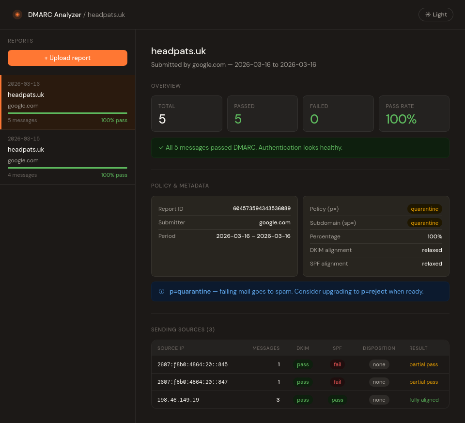

# dmarc-analyzer

> [!WARNING]
> Vibe coded — use at your own risk.
>
> This is an ad hoc tool I put together for my own setup. It is not robust, not
> production-hardened, and not intended for general use. It works for me. It may
> not work for you, may break unexpectedly, and comes with no guarantees
> whatsoever. If you use it, you're on your own.

A self-hosted DMARC aggregate report analyzer. Scans a Maildir for DMARC report
emails, extracts and parses the XML attachments, and serves a small web UI
showing a feed of reports with pass/fail breakdowns per sending IP.



---

## How it works

Three moving parts:

- **`dmarc-scanner.py`** — a Python script that scans a Maildir, extracts DMARC
  zip/xml attachments from matching emails, parses the XML, and writes a
  `reports.json` feed file. Runs as a systemd oneshot on a timer.
- **`dmarc-server.py`** — a minimal stdlib Python HTTP server that serves the
  frontend HTML and the `reports.json` feed on `localhost:PORT`. Intended to sit
  behind a reverse proxy.
- **`src/`** — the frontend source. `build.py` combines `index.html`,
  `style.css`, `app.js`, inlined fonts, and bundled JSZip into a single
  self-contained `dmarc-feed.html`.

---

## Project layout

```text
dmarc-analyzer/
├── build.py              # assembles dmarc-feed.html from src/
├── dmarc-feed.html       # built output — committed, used by the flake
├── src/
│   ├── index.html        # HTML shell with {{PLACEHOLDER}} tokens
│   ├── style.css
│   └── app.js
├── package.json          # jszip + fontsource deps for build
├── flake.nix
├── module.nix            # NixOS module
├── packages.nix          # packages
├── dmarc-scanner.py
└── dmarc-server.py
```

---

## Building the frontend

One-time setup:

```bash
npm install
```

After editing anything in `src/`:

```bash
python3 build.py
```

Or use the dev shell:

```bash
nix develop
python3 build.py
```

---

## NixOS module

Add the flake input to your system flake:

```nix
inputs.dmarc.url = "github:Francesco149/dmarc-analyzer";
```

Import the module and configure:

```nix
imports = [ inputs.dmarc.nixosModules.dmarc-analyzer ];

services.dmarc-analyzer = {
  enable        = true;
  mailDir       = "/var/vmail/example.com/postmaster/mail";
  scanUser      = config.mailserver.vmailUserName;
  port          = 8741;

  # Default is 127.0.0.1. Set to a LAN IP if your reverse proxy
  # is on a different machine. Restrict with a firewall rule.
  listenHost    = "0.0.0.0";

  scanInterval  = "15min";  # systemd OnUnitActiveSec format
  maxReports    = 200;
};
```

Wire into your reverse proxy — e.g. Caddy:

```Caddyfile
dmarc.box.example.com {
    reverse_proxy 10.0.10.x:8741
}
```

### Module options

| Option         | Default          | Description                                                                                                                     |
| -------------- | ---------------- | ------------------------------------------------------------------------------------------------------------------------------- |
| `enable`       | —                | Enable the service                                                                                                              |
| `mailDir`      | —                | Path to Maildir or mbox containing DMARC report emails                                                                          |
| `scanUser`     | `dmarc-analyzer` | User to run the scanner as. Must have read access to `mailDir`. With nixos-mailserver, set to `config.mailserver.vmailUserName` |
| `port`         | `8741`           | Port the HTTP server listens on                                                                                                 |
| `listenHost`   | `127.0.0.1`      | Address to bind to                                                                                                              |
| `scanInterval` | `15min`          | How often to scan for new reports                                                                                               |
| `maxReports`   | `200`            | Max reports kept in `reports.json`                                                                                              |

### Notes

- The module does **not** touch Caddy, nginx, `/etc/hosts`, or any other system
  config. Reverse proxy wiring is left to you.
- The scanner runs as `scanUser` (e.g. `virtualMail`) so it can read a
  `700`-mode Maildir. Output files are written as group `dmarc-analyzer` so the
  HTTP server can read them.
- State lives in `/var/lib/dmarc-analyzer/`. Deleting it is safe — systemd will
  recreate the directories on next start via `StateDirectory`.
- The HTTP server only ever serves two paths: `/` (the frontend) and
  `/data/reports.json`. Everything else returns 404.

---

## Firewall

If `listenHost` is not `127.0.0.1`, restrict access with a firewall rule. With
NixOS iptables:

```nix
networking.firewall.extraCommands = ''
  iptables -A nixos-fw -s <rproxy-ip> -d <mail-lan-ip> -p tcp --dport 8741 -j nixos-fw-accept
'';
networking.firewall.extraStopCommands = ''
  iptables -D nixos-fw -s <rproxy-ip> -d <mail-lan-ip> -p tcp --dport 8741 -j nixos-fw-accept || true
'';
```

---

## Frontend — standalone use

The built `dmarc-feed.html` is fully self-contained (fonts and JSZip inlined).
It can be used without the backend — just open it in a browser and upload `.zip`
or `.xml` report files directly. When hosted, it automatically fetches
`/data/reports.json` on load.
